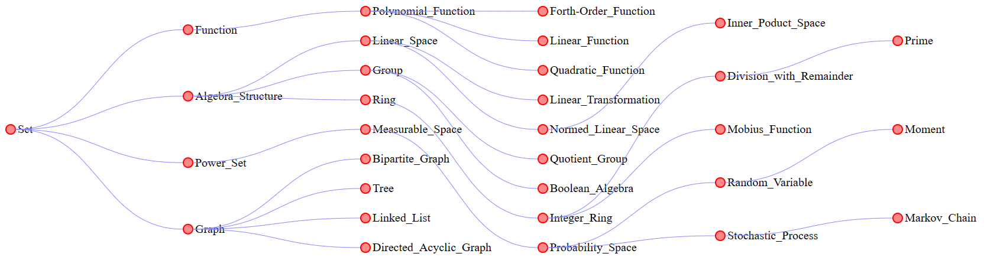
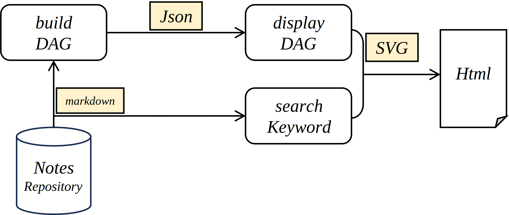

# Note Management System

[TOC]

## Concept

### Note Format

- **Entity / Concept**: Take a mathematical entity as a note.
- **Define**: The definition of this concept.
- **Property**: The important properties of this concept.
- **Include**: Subsets of this concept.
- **Problem**: The classic problem derived from this concept.

### Knowledge Graph of Nodes

- If a hyperlink appears in the definition `Definie`, it indicates that it is the parent node of this concept.
- Other hyperlinks that appear are child nodes of this concept.
- All concepts together form a directed acyclic graph.
- Specific implementation reference `./admin/`



## System



### Analysis Notes Repository & build DAG

 [readMarkdown.py](readMarkdown.py) 

#### DAG nodes of notes 

```python
class Cell:
    string name
    string url
    []     content
    set    kid 
    set    parent 
```

#### Analysis markdown

用于读取单个Markdown文件的内容，并提取其中的链接信息。它接受一个Markdown文件路径作为输入参数。

- 打开Markdown文件，读取文件内容，并提取文件名。
- 如果文件名不在`cellLib`字典中，则创建一个新的`Cell`对象，并将其添加到`cellLib`字典中。
- 将Markdown文件的内容存储到对应的`Cell`对象的`content`属性中。
- 使用正则表达式找到文件内容中的所有Markdown链接，并提取链接的文件名。
- 使用正则表达式查找Markdown文件中名为"Define"的章节，提取其内容。
- 遍历提取到的链接文件名：
  - 如果链接指向的文件名在"Define"章节中，则将当前文件名添加到对应链接文件的`parent`属性中，将链接文件名添加到当前文件的`kid`属性中。
  - 否则，将当前文件名添加到链接文件的`kid`属性中，将链接文件名添加到当前文件的`parent`属性中。

#### Analysis Repository

接收一个文件夹路径作为参数，遍历读取文件夹下Markdown文件。定义了一个空的字典 `cellLib` 用于存储 `Cell` 对象。将 `cellLib` 字典转换为可序列化的字典 `serializable_cellLib`，其中键为单元格名称，值为单元格对象的字典表示形式。最后，将生成的 JSON 字符串写入到名为 `cellLib.json` 的文件中。

### display DAG

 [drawGraph.js](drawGraph.js) 

- 从 JSON 文件中读取有向图数据，然后使用 SVG 绘制一个有向无环图（DAG）
-  `drawDAG` 函数，绘制有向无环图。它接受一个参数 `root`，表示图的根节点名称。
-  `findRoots` 函数，查找有向图中的根节点，返回一个包含所有根节点名称的数组。
-  `bfs` 函数，执行广度优先搜索（BFS）算法，以确定每个节点在图中的位置（level 和 index）。

#### Draw nodes & edges

-  `draw` 递归函数，绘制图的节点和边，接受四个参数：SVG 元素，当前节点，节点位置信息，和已访问节点的集合。
- `drawNode` 函数，绘制图中的节点，接受节点的坐标、名称和 URL 作为参数，并创建一个包含圆形和文本的 SVG 元素。
-  `drawEdge`函数，绘制图中的边，接受两个节点的坐标作为参数，并在 SVG 中创建一条曲线路径表示边。

### search Keyword

 [find.html](find.html) 

一个简单的文件搜索功能，用户可以输入关键字，程序会搜索所有以 `.md` 结尾的文件，将匹配的行显示在页面上，并将匹配的关键字进行了高亮处理。

- searchFiles 函数，当用户点击搜索按钮时触发，获取用户输入的关键字，清空之前的搜索结果，创建一个表格，并添加表头，遍历 `files` 集合中的每个文件 URL，并对以 `.md` 结尾的文件调用 `searchInFile()` 函数。
- searchInFile 函数，接收文件 URL、关键字和表格作为参数，将文件内容按行分割，遍历每一行，对关键字进行搜索，如果找到匹配的行，就在表格中添加一行，显示文件名、行号和匹配文本，并对匹配文本进行高亮处理。
- highlightKeyword 函数，接收文本和关键字作为参数，将匹配的关键字用 `<span class="highlight">` 标签包裹起来，实现高亮显示效果。