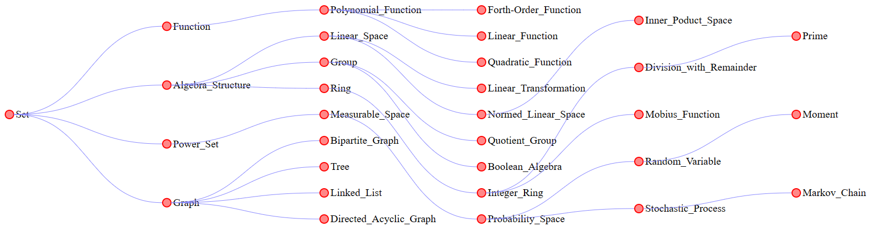

# $Mathematic\ Library$

[TOC]

 [index.html](index.html) 

## Note Format

- **Entity / Concept**: Take a mathematical entity as a note.
- **Define**: The definition of this concept.
- **Property**: The important properties of this concept.
- **Include**: Subsets of this concept.
- **Problem**: The classic problem derived from this concept.

### Knowledge Graph of Nodes

- If a hyperlink appears in the definition `Definie`, it indicates that it is the parent node of this concept.
- Other hyperlinks that appear are child nodes of this concept.
- All concepts together form a directed acyclic graph.
- Specific implementation reference `./admin/`

