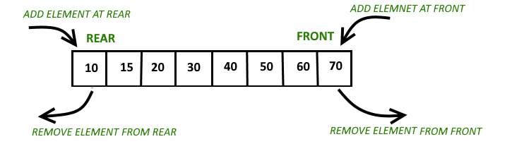
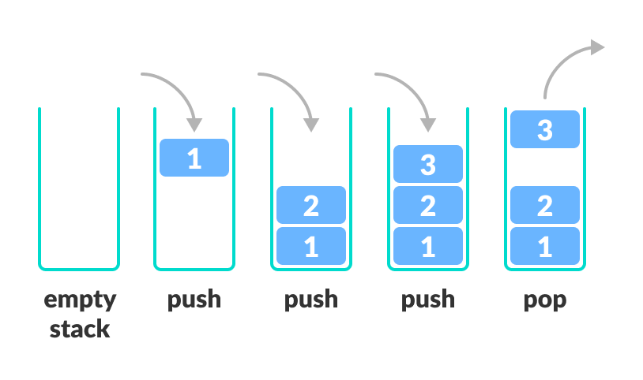

# $Deque$

[TOC]

## Define  
Deque is a finite sequence that only allow to insert and delete elements from its head and tail.

## Include

### Queue

- Define  
  Queue is a finite sequence that only allow to insert elements from its tail and delete elements from its head. (First-in first-out.)

### Stack

- Define  
  Stack is a finite sequence that only allow to insert and delete elements from its head. (First-in last-out.)

  
  
- Include
  * Monotone Stack 
    - Define  
      A stack that maintain its elements in a monotone order.

### Priority Queue