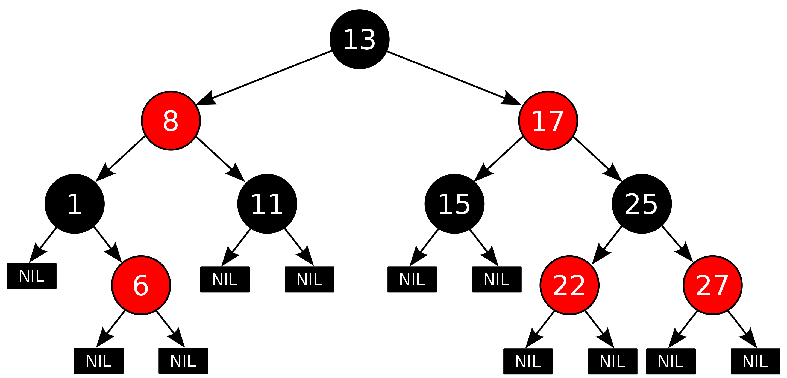

# Red-Black Tree

[TOC]

## Define  
A Red-Black Tree is a type of self-balancing binary search tree.

1. Every node is either red or black.
2. The root is black.
3. Every leaf (NIL) is black.
4. If a node is red, then both its children are black.
5. For each node, all simple paths from the node to leaves contain the same number of black nodes.

## Property

- insert a node

- delete a node  
- rotate left & rotate right