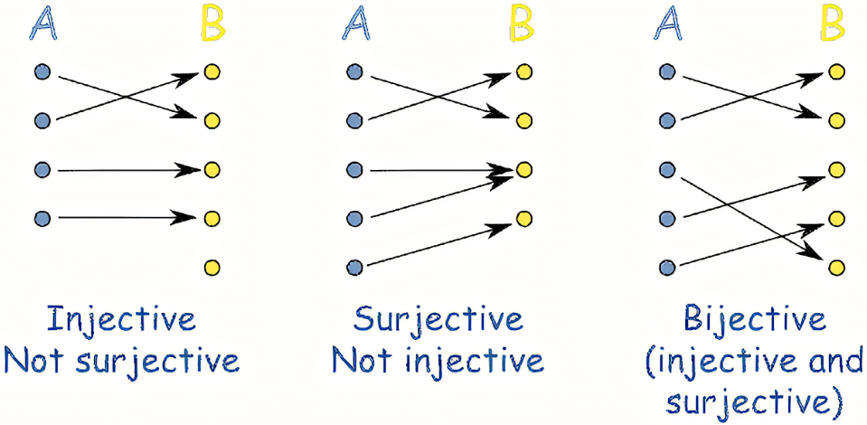

# $Mapping, Function$

[TOC]

## Define  
$$
f: X \to Y  \tag{Function}
$$
$$
\forall x \in X, \exists_{= 1} y \in Y, f(x) = y
$$
Mapping, refer to a [binary relation](./Set.md) from the element of set $X$ to that of set $Y$, and satisfy any element in $X$ has a unique element in $Y$ corresponding to it (One-to-many is not allowed).

$X$: domain of Definition.

## Include

### Injective

- Define  
  $$
  \forall x, x', f(x) = f(x') \Rightarrow x = x'
  $$
  Each mapped element $y$ has a unique element $x$ corresponding to it.

### Surjection

- Define
  $$
  \forall y \in Y, \exists x \in X, f(x) = y
  $$
  Each element $y$ in set $Y$ has a element $x$ in set $X$ corresponding to it.

### Bijection , One-to-One Correspondence

- Define
  $$
  \forall y \in Y, \exists_{= 1} x \in X, f(x) = y
  $$
  A map that is both injective and surjective. Each element $y$ in set $Y$ has a unique element $x$ in set $X$ corresponding to it. Meanwhile, each element $x$ in set $X$ has a unique element $y$ in set $Y$ corresponding to it.

- Property
  * Inverse Function
    - Define  
      if $f$ is a bijection, its inverse function is $f^{-1}(b) = a \Leftrightarrow f(a) = b$

## Example

* Real-Value Function & Complex-Value Function
* Sequence