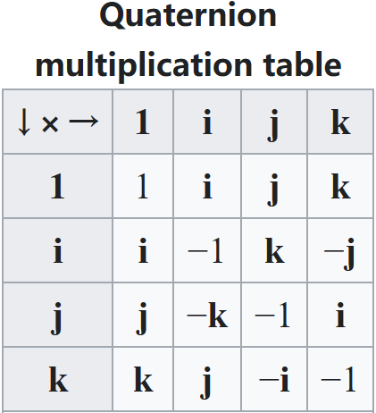

# $Quaternion\ Ring$

## Define

$$
q = a + b i + c j + d k
$$

Quaternion number system extends the complex numbers. Where $a, b, c, d \in \mathbb R$ are [real numbers](./Real_Field.md), and $i, j, k$ are symbols that can be interpreted as unit-vectors pointing along the three spatial axes. (Quaternion [Ring](./Ring.md)) The multiplication rules for the basis elements are:
$$
i^2 = j^2 = k^2 = ijk = -1
$$

## Property

- The conjugate of a quaternion is defined as: $q^* = a - b i - c j - d k$.

- Quaternion & Rotation
  $$
  q = \cos(\frac{\theta}{2}) + \sin(\frac{\theta}{2})(xi + yj + zk)
  $$
  $\theta$ is the angle of rotation, $x, y, z$ is the unit vector component of the axis of rotation.

  - Spherical linear interpolation

  