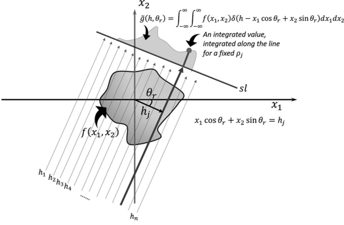

# Radon Translation

## Define

For a function $f(\boldsymbol x)$ that satisfies the three regularity conditions as above, **Radon Translation** $\mathcal R f$ is is a [function](./Function.md) (integral transform) defined on the space of straight lines $L \subset \mathbb R^2$ by the line integral along each such line as, 

- $f(x)$ is continuous.
- the double integral $\iint \frac{|f(x)|}{\sqrt{x^2 + y^2}} \mathrm{d}x\mathrm{d}y$, extending over the whole plane, converges.
- for any arbitrary point $(x, y)$ on the plane it holds that $\lim\limits_{r\to\infty} \int\limits_{0}^{2\pi} f(x+r\cos\varphi, r + \sin\varphi) \mathrm{d}\varphi = 0$.

$$
\begin{align*}
\mathcal R f(L) &= \int_L f(\boldsymbol x) |\mathrm{d} \boldsymbol x| \\
\mathcal R f(\theta, r) &= \int_{-\infty}^{+\infty} f(z \sin \theta + r \cos \theta, -z \sin \theta + r \cos \theta) \mathrm{d} z
\end{align*}
$$

## Property

- The two-dimensional Fourier transform of the initial function along a line at the inclination angle is the one variable Fourier transform of the Radon transform (acquired at angle of that function.
  $$
  F(s\theta)=\int _{\mathbb {R} }{\mathcal {R}}f(\theta ,r)e^{-2\pi isr}\,\mathrm{d}r
  $$
  

### Radon inversion formula

$$
\begin{align*}
f(\mathbf {x} )&=\int _{0}^{\pi }(\mathcal {R}f(\cdot ,\theta )*h)(\left\langle \mathbf {x} ,\mathbf {n} _{\theta }\right\rangle )\mathrm{d}\theta\\
f(x, y) &= \int_0^\pi (\mathcal F_r^{-1}(\mathcal F_r(\mathcal R f(\theta, r))(\omega))\cdot|\omega|)(x \sin \theta + y \cos \theta)\mathrm{d}\theta
\end{align*}
$$

where $h$ is such that $\hat h(k) = |k|$. The result obtained by Fourier transforming the Radon transform result $\mathcal{R}f(\theta, r)$ is filled into the line passing through the origin at an angle of $\theta$, and finally the inverse Fourier transform is performed to obtain the original function $f(x, y)$.

- Proof

  Fourier Transform of the Radon Transform:
  $$
  \begin{align*}
  \mathcal F_r(\mathcal R f(\theta, r))(\omega) &= \int_{-\infty}^{+\infty} \mathcal R f(\theta, r) e^{i\omega r} \mathrm{d} r\\
  &= F(\omega\cos\theta, \omega\sin\theta)\delta(\omega)
  \end{align*}
  $$
  
  $$
  \Rightarrow f(x, y) = \int_0^\pi (\mathcal F_r^{-1}(\mathcal F_r(\mathcal R f(\theta, s))(\omega))\cdot|\omega|)(x \sin \theta + y \cos \theta)\mathrm{d}\theta
  $$
  
  