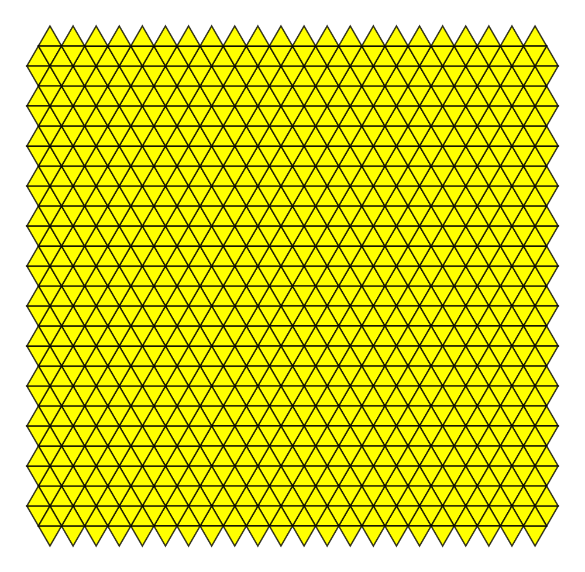
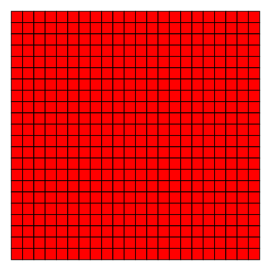
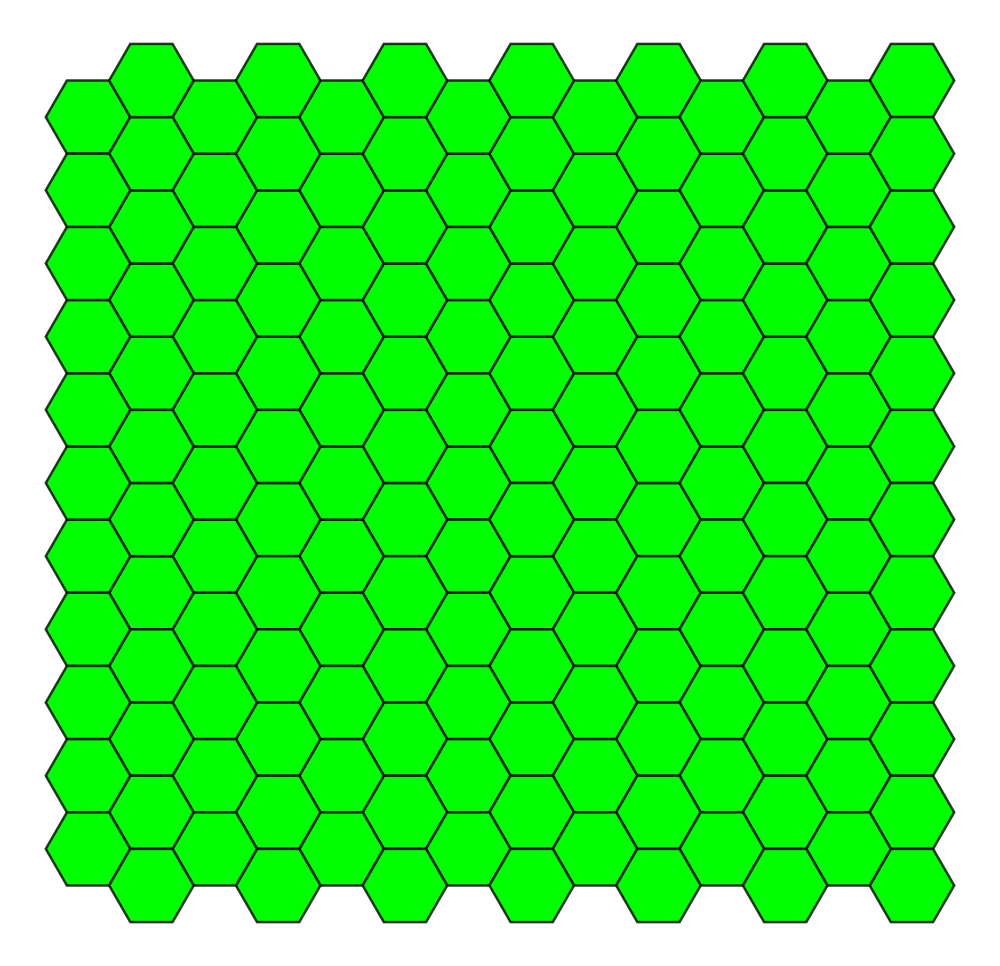
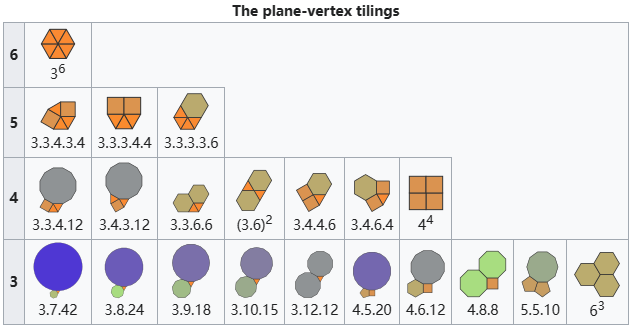
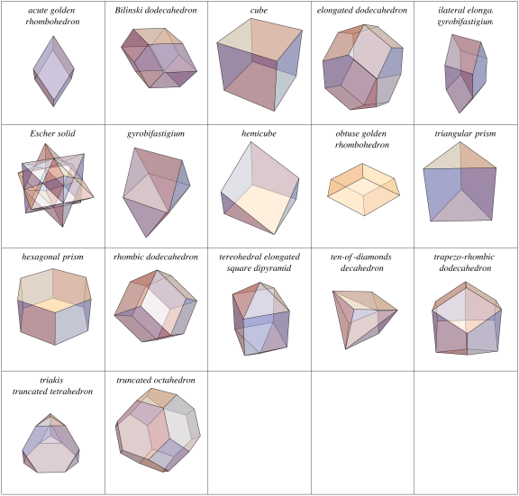
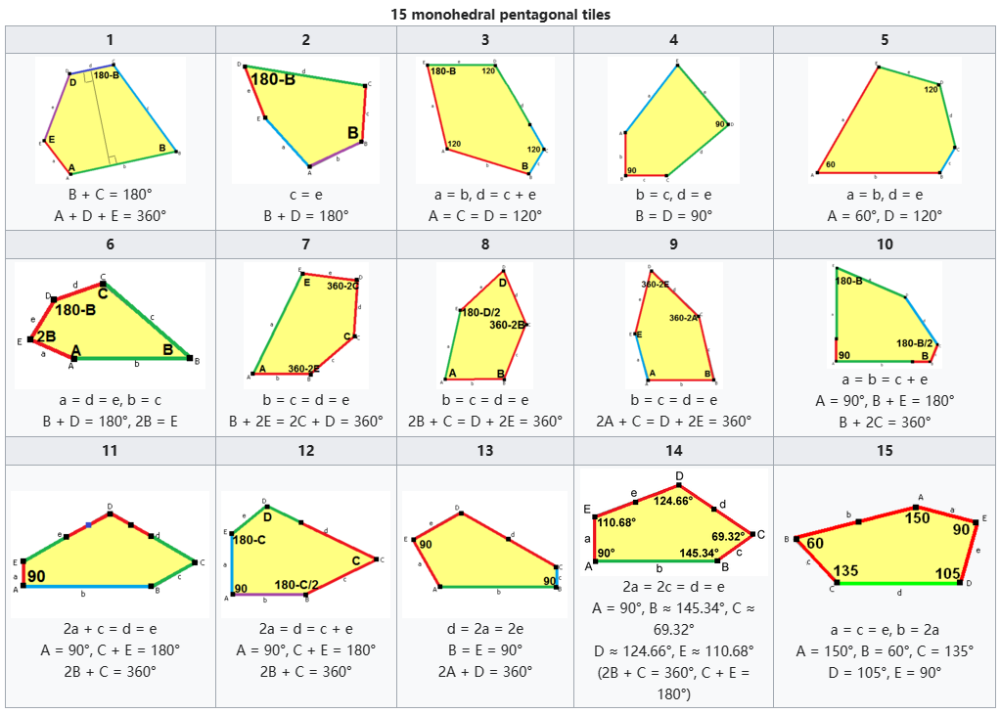
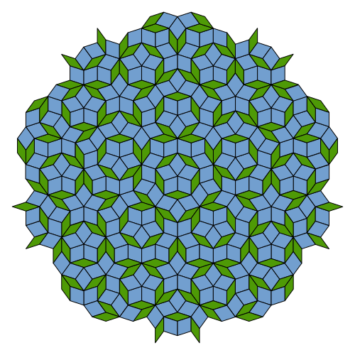

# $Euclidean\ Space$

[TOC]

## Define

Euclidean space is a finite dimensional [Hilbert space](./Hilbert_Space.md) over a [real number field](./Real_Field.md), and has a standard dot product as its inner product. Let $n \in \mathbb{N}$ (the set of natural numbers). The $n$-dimensional Euclidean space, denoted as $\mathbb{R}^n$, is the set of all ordered $n$-tuples of real numbers. That is,
$$
\mathbb{R}^n = \{(x_1, x_2, \dots, x_n) : x_i \in \mathbb{R} \text{ for } i = 1,2, \dots, n\}
$$

In $\mathbb{R}^n$, we define the following operations:

1. **Vector Addition:** For any two vectors $\mathbf{v} = (v_1, v_2, \dots, v_n)$ and $\mathbf{w} = (w_1, w_2, \dots, w_n)$ in $\mathbb{R}^n$, their sum is given by:
$$
\mathbf{v} + \mathbf{w} = (v_1 + w_1, v_2 + w_2, \dots, v_n + w_n)
$$

2. **Scalar Multiplication:** For any scalar $c \in \mathbb{R}$ and vector $\mathbf{v} = (v_1, v_2, \dots, v_n)$ in $\mathbb{R}^n$, the scalar product is:
$$
c \cdot \mathbf{v} = (c v_1, c v_2, \dots, c v_n)
$$

3. **Inner Product (Dot Product):** The inner product of two vectors $\mathbf{v} = (v_1, v_2, \dots, v_n)$ and $\mathbf{w} = (w_1, w_2, \dots, w_n)$ in $\mathbb{R}^n$ is defined as:
$$
\mathbf{v} \cdot \mathbf{w} = v_1 w_1 + v_2 w_2 + \dots + v_n w_n
$$

From this inner product, we can derive the **Euclidean norm** of a vector $\mathbf{v}$ as:
$$
||\mathbf{v}|| = \sqrt{\mathbf{v} \cdot \mathbf{v}}
$$

With these operations, $\mathbb{R}^n$ becomes a **real inner product space**. The geometry induced by the inner product is the familiar Euclidean geometry, and the distance between two vectors $\mathbf{v}$ and $\mathbf{w}$ is given by the norm of their difference:
$$
d(\mathbf{v}, \mathbf{w}) = ||\mathbf{v} - \mathbf{w}||
$$

## Property

## Problem

### Tessellation

A tessellation or tiling is the covering of a surface, often a plane, using one or more geometric shapes, called tiles, with no overlaps and no gaps.

#### Convex regular polygon tiling

There are three methods for dense tiling of a monohedral regular polygon in a plane: equilateral triangle, square, and regular hexagon.

There are 17 combinations of regular convex polygons that form 21 types of plane-vertex tilings.

#### Space-Filling Polyhedron

#### Monohedral Pentagonal tiling

#### Penrose tiling

A Penrose tiling is an example of an aperiodic tiling.

