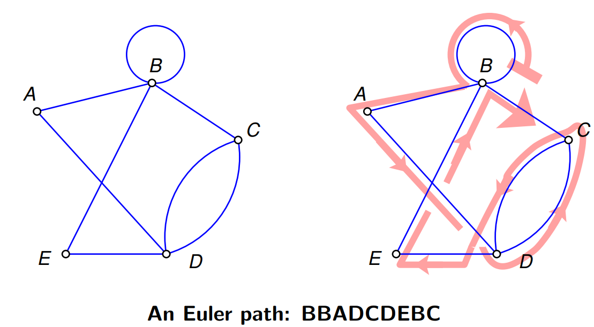
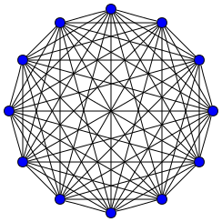

# $Graph$

[TOC]

## Define  
$$
G = (V, E)  \tag{Graph}
$$
$$
E = \{(v_i, v_j)\ |\ v_i, v_j \in V\}  \tag{Edge set}
$$

Graph is a pair consist of vertex set $V$ and edge set $E$ with weights of edges $w: E \to \mathbb R$.

|Symbol|Means|
|---|---|
|$V$|Vertex set |
|$E$|Edge set, a set of paired vertices|
|$w: E \to \mathbb R$|weight of edge|  
|||

Undirected Graph, is a type of graph that does not distingush the direction of edges.
$$
E = \{\{v_i, v_j\}\ |\ v_i, v_j \in V\}
$$

Directed Graph, is a type of graph that distingush the direction of edges and its edge set is a set of ordered pairs.
$$
E = \{(v_i, v_j)\ |\ v_i, v_j \in V\}
$$

## Property  

### Degree  
Degree of a node refers to the number of edges connecting this node. 

### Representation by Adjasency Matrix  
Due to the discreteness of vertices, we can represente the weight of edge $w: E \to \mathbb R$ by Matrix $\boldsymbol G \in \mathbb R^{n \times n}$.

$$
\boldsymbol G = \left(\begin{matrix} w(v_1, v_1) & \cdots & w(v_1, v_n) \\ \vdots&\ddots &\vdots \\ w(v_n, v_1) & \cdots & w(v_n, v_n) \end{matrix}\right)
$$

### Connectivity

- Problem: Determine connectivity
  * Union-Find Sets  
    Union-Find Sets is a data structure that maintains a collection of disjoint sets, each containing a number of elements. It provides two operations: Union and Find.

    The Union operation takes two elements from different sets and merges them into a single set.  
    The Find operation is used to determine which set an element belongs to. It takes an element as input and returns a representative element of the set containing that element.  

### Directivity

### Acyclicity

### Euler Path & Euler Graph

- Define  
  Euler path is a path in a graph that passes through every edge exactly once. If the path starts and ends at the same vertex, it is called an Euler circuit. A graph that has an Euler circuit is called an Eulerian graph, while a graph that has an Euler path but not an Euler circuit is called a semi-Eulerian graph. 

  
  
- Property
  - The existence of an Euler path or circuit in a connected undirected graph depends on the degree of the vertices. For a graph to have an Euler circuit, every vertex must have an even degree. For a connected undirected graph to have an Euler path, exactly two vertices must have an odd degree (all other vertices must have even degree).

- Problem: search Euler Path
  - Hierholzer's algorithm 
  
    ```python
    def find_eulerian_path_or_cycle(graph):
        current_vertex = next(iter(graph))
    
        stack = [current_vertex]
        path = []
    
        while not stack.empty():
            if not graph[current_vertex].empty():
                stack.append(current_vertex)
                next_vertex = graph[current_vertex].pop()
               
                if graph[current_vertex].empty():
                    del graph[current_vertex]
                current_vertex = next_vertex
            else:
                path.append(current_vertex)
                current_vertex = stack.pop()
    
        if not graph.empty():
            return None
        return path
    ```
  
    

### Matching of Graph

- Define  
  $$
  \forall e_i, e_j \in M \subseteq E, e_i \neq e_j \quad\Rightarrow\quad v(e_i, 1) \neq v(e_i, 2) \neq v(e_j, 1) \neq v(e_j, 2)  \tag{Matching}
  $$
  Matching of a graph is a set of edges $M \subseteq E$ that have no common points between any two edges.

- Include
  - Maximum Matching  
    $$
    M^* = \arg\max_{M} \quad \text{number}(M) \tag{Maximum Matching}
    $$
    Maximum Matching is a matching with the largest number of matching edges among all matches in a graph.
  - Perfect Matching  
    $$
    V^{(G)} = v(M^*)
    $$
    Perfect Matching is a matching that all vertices of the graph are in it.

## Include

* Complete Graph
  - Define  
    Complete Graph is a undirected graph in which every pair of vertices is adjacent.  
    
    
  
  - Property
  
    A complete graph containing $n$ vertices,
  
    - $number(E) = \frac{n(n-1)}{2}$
    - The degree of each vertex is $n-1$
  
* [Tree](./Tree.md)

* [Directed Acyclic Graph](./Directed_Acyclic_Graph.md)

* [Bipartite Graph](./Bipartite_Graph.md)

## Problem

### Traversal

- Depth-First Search  
  
  - Define: DFS is a graph traversal that dives as deep as possible into a graph before backtracking.
  
  - Algorithm: Depth first search is implemented based on stack or recursion.
  
    recursion:
  
    ```python
    def dfs(graph, node, result):
        if node not in result:
            result.add(node)
            for neighbor in graph[node]:
                dfs(graph, neighbor, result)
        return result
    ```
  
    stack :
  
    ```python
    def dfs(graph, start):
        stack.push(start)
        
        while not stack.empty():
            node = stack.pop()
            result.add(node)
            for neighbor in graph[node]:
                stack.push(neighbor)
        return result
    ```
  
- Breadth-First Search

  - Define: BFS is a graph traversal that explores all of the neighbor nodes at the present depth before moving on to nodes at the next depth level.
  
  - Algorithm: Breadth-first search is implemented based on queues.
  
    ```python
    def bfs(graph, start):
        queue.push(start)
        
        while not queue.empty():
            node = queue.pop()
            result.add(node)
            for neighbor in graph[node]:
                queue.push(neighbor)
        return result
    ```
  

### Shortest Paths

- Problem

  For a graph $G = (V, E)$ with edge weight $w : E \to \mathbb R$, we aim to find the minimum sum of edge weights of path $P(v_s, v_e)$ from $v_s \to v_e$, 
  $$
  P(v_s, v_e) = \left(e_{1}^{(P)}, ..., e_{m}^{(P)} \ |\ e_{i}^{(P)} \in E, e_{1}^{(P)}[1] = v_{s}, e_{m}^{(P)}[2] = v_{e} \right) \tag{Path}
  $$

  $$
  \begin{align*}
  d(v_s, v_e) = \min_{P} \quad& \sum_{e_{i}^{(P)} \in P} w(e_{i}^{(P)}) \\
  s.t. \quad& e_{1}^{(P)}[1] = v_{s}\\
    & e_{m}^{(P)}[2] = v_{e}
  \end{align*}
  $$
  
- Property

    - The shortest path has no loop
      $$
      e_{i}^{(P)} \neq e_{j}^{(P)} \quad, \text{if } i \neq j
      $$

    - If $v_i$ and $v_j$ are relay nodes of shortest path $P_{\min}(v_1, v_k)$ between the node $v_1$ and $v_k$, then the subpath $P_{\min}(v_i, v_j) = (v_i, ..., v_j) \subset P(v_1, v_k)$ is the shortest path between the node $v_i$ and $v_j$. 
      $$
      P(v_i, v_j) \subset P_{\min}(v_1, v_k)  \Rightarrow  P_{\min}(v_i, v_j) = P(v_i, v_j)
      $$

    - $\forall (v_i, v_j) \in E$
      $$
      d(v_s, v_j) \le d(v_s, v_i) + w((v_i, v_j))
      $$
      because $s \to i \to j$ is also a feasible path, then $d(P_{min}) \le d(P_{s \to i \to j})$.

    - estimation of the shorteset paths and distances
      - Initial estimation  
        $$
        \begin{align*}
        \tilde d(v_s, v_s) &\gets 0  \tag{estimation of the shorteset distance}\\
        \tilde d(v_s, v_i) &\gets \inf, \quad v_i \in V - \{v_s\}\\
        \tilde P(v_s, v_i) &\gets (v_s), \quad v_i \in V  \tag{estimation of the shorteset path}\\
        \end{align*}
        $$

        where, $\tilde d(v_s, v_i)$ is the estimation and upper-bound of $d(v_s, v_i)$, while $\tilde P(v_s, v_i) \Leftrightarrow \tilde d(v_s, v_i) = \inf$.

      - Update estimation  
        if there is an edge $(v_i, v_j)$, make the path better $\tilde d(v_s, v_j) > \tilde d(v_s, v_i) + w((v_i, v_j))$, then,
        $$
        \begin{align*}
        \tilde d(v_s, v_j) &\gets \tilde d(v_s, v_i) + w((v_i, v_j))  \\
        \tilde P(v_s, v_j) &\gets \tilde P(v_s, v_i) + (v_j)
        \end{align*}
        $$

        for a subgraph $G' = G - (\{v_i\}, \{(v_i, \cdot), (\cdot, v_i)\})$, we have  

        $$
        \begin{align*}
          d^{(G)}(v_s, v_i) &= \min_{v_j \in V^{(G')}} \left(d^{(G')}(v_s, v_j) + w((v_j, v_i))\right)  \\
          d^{(G)}(v_s, v_j) &\le d^{(G)}(v_s, v_i) + w(v_i, v_j) \quad, \forall (v_i, v_j) \in E^{(G)}  \\
          P_{\min}^{(G)}(v_s, v_i) &= \arg\min_{P_{\min}^{(G')}(v_s, v_j)} \left(d\left(P_{\min}^{(G')}(v_s, v_j)\right)+ w((v_j, v_i))\right) + (v_i)
        \end{align*}
        $$

- Algorithm

    * Floyd's Algorithm  
      Base on danamic programming, there is a Tensor $M^{(d)}, M^{(p)} \in \mathbb R^{n \times n \times (n+1)}$, where $M_{i, j, k}$ refer to the minimum distance and path from $v_i \to v_j$ with optional intermediate vertices $\{v_1, ..., v_k\}$. When $k = 0$, $M_{i, j, 0}$ refer to the distance of direct path $(v_i, v_j)$ with no intermediate vertice. When $k = n$, $M_{i, j, n}$ is the answer of the shorest distance and path of all virtice pairs.
      $$
      \begin{align*} 
        G &= M^{(d)}_{\cdot, \cdot, 0}  \\
        D &= M^{(d)}_{\cdot, \cdot, n}
      \end{align*}
      $$

      For $k$ and optional intermediate vertices $\{v_1, ..., v_k\}$, $M^{(d)}_{\cdot, \cdot, k}$ could be obtained by $M^{(d)}_{\cdot, \cdot, k-1}$ through determines whether to select $v_k$ as the intermediate node.
      $$
        M^{(d)}_{i, j, k} = \min \left(M^{(d)}_{i, j, k-1},\ M^{(d)}_{i, k, k-1} + M^{(d)}_{k, j, k-1}\right)
      $$

      ```c
      dis = G;
      
      for (int k = 1; k <= N; k++)
        for (int i = 1; i <= N; i++)
          for (int j = 1; j <= N; j++)
            dis(i, j) = dis(i, j) > dis(i, k) + dis(k, j) ?
                        path(i, j) = k, dis(i, k) + dis(k, j) :
                        dis(i, j);
      ```
      
    * Dijkstra Algorithm  
      - Process 
        - Initially, we mark all nodes as unvisited and set the distance from source node to the itself to zero, and the distance to all other nodes to infinity.
        - Select the unvisited node with the smallest distance from source node (the first selected node is source node itself), mark it as visited, and update the distance of all nodes through the new node accordingly.
        - Repeat above step until the destination node is visited or there are no more unvisited nodes.
      
      ```python
      def dijkstra(graph, start):
          shortest_path = {vertex: float('infinity') for vertex in graph}
          shortest_path[start] = 0
          
          priority_queue.push((0, start))
          
          while priority_queue:
              current_distance, current_vertex = priority_queue.pop()
              
              if current_distance > shortest_path[current_vertex]:
                  continue
      
              for neighbor, weight in graph[current_vertex].items():
                  distance = current_distance + weight
      
                  if distance < shortest_path[neighbor]:
                      shortest_path[neighbor] = distance
                      priority_queue.push((distance, neighbor))
      
          return shortest_path
      ```
      
      
      
    * Bellman Ford


### Minimum Spanning Tree

- Purpose  
  Find a Tree (acyclic subgraph) on the undirected Graph $T \subseteq G, V^{(T)} = V^{(G)}$ with the smallest sum of edge weights connected all nodes.

  $$
  \begin{align*}
    T_{\min} =  \arg\min_{T \subseteq G} \quad & \sum_{e \in E^{(T)}} w(e)  \\
    s.t. \quad & V^{(T)} = V^{(G)} \\
    & T \text{ is acyclic}
  \end{align*}
  $$

- Property
    $$
    \begin{align*}
      T_{\min}^{(G)} &\Rightarrow \left(T_{\min}^{(G)} - \{v_i\}\right) \text{ is a min spanning tree of } (G - \{v_i\})  \\
      T_{\min}^{(G - \{v_i\})} &\Rightarrow \left(T_{\min}^{(G - \{v_i\})} + \arg\min_{e \in (v_i,\cdot)} w(e) \right)  \text{ is a min spanning tree of } G
    \end{align*}
    $$

- Algorithm  
  * Prim's Algorithm  
    Greed by vertices, put the shortest edge $(u,v)$ of $u$ from the searched vertices into the result edge sequence every time, and $v$ does not belong to the searched vertices. $T_{\min, k}$ refers to a sub-tree of $T_{\min}$ with $k+1$ vertices and $k$ edges.
    $$
    \begin{align*} 
      T_{\min, 0} &= (\{v_1\}, \emptyset)  \tag{initial}\\
      T_{\min, n} &= T_{\min}  \tag{answer}
    \end{align*}
    $$
  
    $$
    \begin{align*}
      (v_k, e_k) = \arg\min_{e_k = (v_k, v')}\quad & w(e_k)  \\
      s.t. \quad
      & e_k \in E^{(G)}  \\
      & v_k \in V^{(G)}  \\
      & v_k \notin V^{(T_{\min, k-1})}  \\
      & v' \in V^{(T_{\min, k-1})}
    \end{align*}
    $$
    $$T_{\min, k} = T_{\min, k-1} + (\{v_k\}, \{e_k\})$$
  
    - Property: Time complexity $O(E \cdot logV)$
  
    ```python
    def prim(graph):
        start_vertex = list(graph.keys())[0]
        result = set()
        visited = set([start_vertex])
        edges = priority_queue()
        edges.push(
            (cost, start_vertex, to)
            for to, cost in graph[start_vertex].items()
        )
    
        while not edges.empty():
            cost, frm, to = edges.pop()
            if to not in visited:
                visited.add(to)
                result.add((frm, to))
                for to_next, cost2 in graph[to].items():
                    if to_next not in visited:
                        edges.push((cost2, to, to_next))
    
        return result
    ```
  
    
  
  * Kruskal's Algorithm  
    Greed by edges. $T_{\min, k}$ refers to a sub-tree of $T_{\min}$ with $k$ edges.
    $$
    \begin{align*} 
      T_{\min, 0} &= (V^{(G)}, \emptyset)  \tag{initial}\\
      T_{\min, n} &= T_{\min}  \tag{answer}
    \end{align*}
    $$
  
    $$
    \begin{align*}
      e_k =& \arg\min_{e_k \in E^{(G)}}\quad w(e_k)  \\
      &s.t. \quad \nexists \text{ path } \in T_{\min, k-1} \text{ , lets } e_k[1] \to e_k[2]
    \end{align*}
    $$
  
    $$
    T_{\min, k} = T_{\min, k-1} + (\{e_k\})
    $$
  
    - Property: Time complexity $O(E \cdot logV)$
  
    Depth first search is implemented based on union-find set.
  
    ```python
    def kruskal(graph):
        result = []
        edges = []
        parent = {}
    
        for vertex in graph:
            parent[vertex] = vertex
            for neighbor, weight in graph[vertex].items():
                edges.append((weight, vertex, neighbor))
    
        edges.sort()
    
        for edge in edges:
            weight, vertex1, vertex2 = edge
            root1 = find(parent, vertex1)
            root2 = find(parent, vertex2)
    
            if root1 != root2:
                result.append(edge)
                union(parent, root1, root2)
    
        return result
    ```

### Network Flow Problem

- Purpose
  We set $G'$ is a sub-graph of $G$, Equal inflow and outflow of non source and sink
  $$
  \begin{align*}
    w'(u, v) &\le w(u, v)  \tag{Flow constraint}\\
    \sum_i w'(u, v_i) &= \sum_i w'(v_i, u)  \quad; u \neq s, u \neq e
  \end{align*}
  $$

- Include
  - Maximum Flow Problem
    - Purpose
      
      Maximum flow rate at source and sink
      $$
      \begin{align*}
        \max \quad & \sum_i w'(v_i, e) = w'(s, v_i) \\
        s.t. \quad & w'(u, v) \le w(u, v) \\
          &\sum_i w'(u, v_i) = \sum_i w'(v_i, u)  \quad ; u \neq s, u \neq e  
      \end{align*}
      $$
      
    - Algorithm
      - Dinic Algorithm
    
  - Minimum Cost Problem

### Travelling Salesman Problem  

- Purpose  
  Find the shortest closed path traversing all given points.
