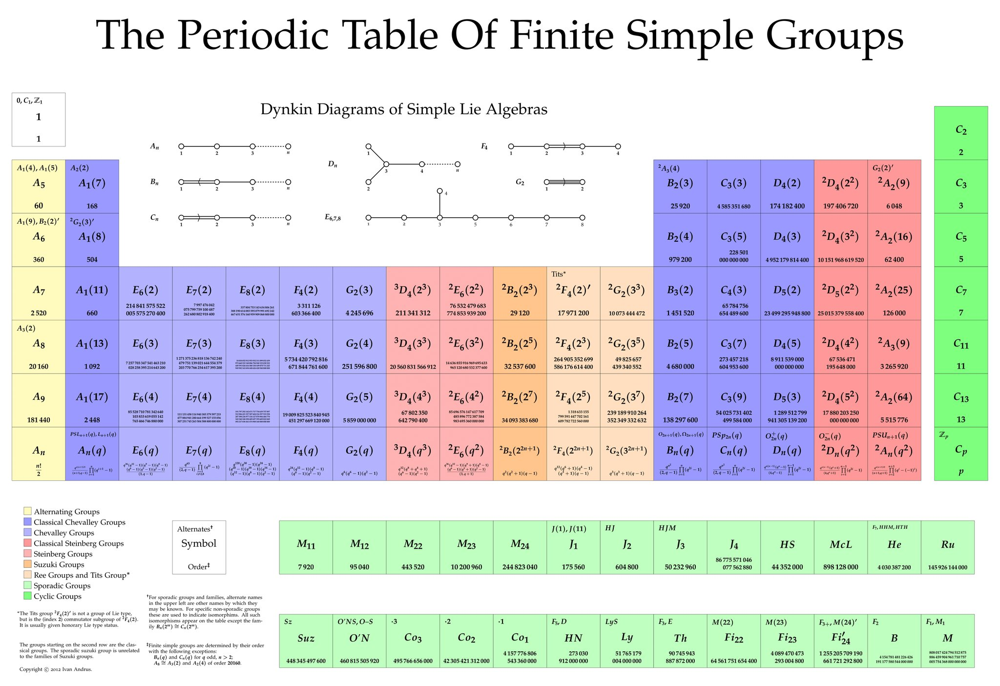

# $Group$

[TOC]

## Define  

$$
(G, \cdot)
$$

Group is an algebraic structure, where $G$ is a set, $\cdot$ is a binary operation, and satisfy:

- closure: $a, b \in G \Rightarrow a \cdot b \in G$
- associative law $(a \cdot b) \cdot c = a \cdot (b \cdot c)$
- exists identity element, $\exists 1: x \cdot 1 = 1 \cdot x = x$
- exists inverse element, $\exists x^{-1}: x \cdot x^{-1} = x^{-1} \cdot x = 1$

## Property

- $1$ is unique
  - Proof  
    $$
    1_1 = 1_1 \cdot 1_2 = 1_2
    $$
- The inverse of each element is unique.
- Absorbing Element
  $$
  x \cdot 0 = 0 \cdot x = 0  \quad; \forall x \in G  \tag{absorbing element}
  $$
- 1 
  - $\forall a \in G, (a^{-1})^{-1} = a$
  - $\forall a,b \in G, (a \cdot b)^{-1} = b^{-1} \cdot a^{-1}$
  - $\forall a,b,c \in G, a\cdot b = a \cdot c  \quad\Rightarrow\quad b = c$
  - $\forall a,b,c \in G, b\cdot a = c \cdot a  \quad\Rightarrow\quad b = c$ 

### Subgroup

- Define  
  $$
  H \subseteq G, H \neq \emptyset, (H, \cdot) \text{ is group } \quad\Rightarrow\quad H \le G  \tag{Subgroup}
  $$

  For a group $(G, \cdot)$ and a nonempty subset $H$ of $G$, if $(H, \cdot)$ is also group, then $(H, \cdot)$ is a subgroup of $(G, \cdot)$.

- Property  
  - $1 \le G, G \le G$

  * Coset
    - Define
      For a subgroup $H$ of the group $G$ and an element $g \in G$, the left cosets of $H$ in $G$ are the sets obtained by multiplying each element of $H$ by a fixed element $g$ (where $g$ is the left factor).
      $$
      gH = \{gh \ |\ h \in H\} \quad, \text{for } g \in G  \tag{left cosets}
      $$

      The right cosets are defined similarly, except that the element g is now a right factor.
      $$
      Hg = \{hg \ |\ h \in H\} \quad, \text{for } g \in G  \tag{right cosets}
      $$

    - Property

      - Cosets form a partition of group $G$, that is, they divide $G$ into several disjoint sets. 

        Each coset of subgroup $H$ have the same number of elements as the subgroup $H$. Two cosets are either identical or completely disjoint. 

  * The size of any subgroup $H$ of a finite group $G$ can be divided by the size of $G$.
    $$
    |H|\ |\ |G|
    $$

#### Normal Subgroup

- Define
  $$
  H \lhd G \quad\Leftrightarrow\quad  g^{-1}hg \in H, \forall h \in H \le G, g \in  G \tag{Normal Subgroup}
  $$
  Normal Subgroup is a subgroup $H \le G$ if it is invariant under conjugation, that is, $\forall h \in H, g \in G$, we have $g^{-1}hg \in H$.

- Property
  * Quotient Group
  
    * Define
  
      Given a group $G$ and a normal subgroup $H \lhd G$, the Quotient Group $G/H$ is a group composed of all left cosets of $H$ in $G$ as elements $\{aH \ |\ a \in G\}$ and multiplication operations $(g_1 H) \cdot (g_2 H) = g_1 g_2 H, \forall g_1, g_2 \in G$.
      $$
      (\{aH \ |\ a \in G\}, \cdot)  \\
      $$
  
    - Property
  
      - The unit element of the quotient group $G/N$ is $N$ itself
  
      $$
      gN \cdot N = gN
      $$
  
      - $|G/H| = \frac{|G|}{|H|}$

### Group Homomorphism

- Define
  $$
  f: G \to H
  $$
  Group Homomorphism is a function $f$ from a group $(G, \cdot)$ to another group $(H, *)$ such that for all $u, v \in G$ it hold that,
  $$
  f(u \cdot v) = f(u) * f(v) \quad, \forall u, v \in G
  $$

- Property
  * Isomorphism of Groups  
    If Group Homomorphism of $G, H$ is a Bijection, the groups $G, H$ are called isomorphic.

### Simple Group

- Define

  A simple group is a group $G$ whose only normal subgroups are the trivial group $\{e\}$ (a trivial group or zero group is a group consisting of a single element $e$) and the group itself.

- Property

  - Classification of finite simple groups

    Every finite simple group is isomorphic to one of the following groups

    - a member of one of three infinite classes of such, namely:
      - the cyclic groups of prime order,
      - the alternating groups of degree at least 5,
      - the groups of Lie type,
      - the derivative of the groups of Lie Type, such as the Tits group
    - one of 26 groups called the "sporadic groups"
  
    

### Commutative Group , Abelian Group

- Define
  Commutative Group is a Group satisfied commutative law,
  $$
  a \cdot b = b \cdot a
  $$

### Cyclic Group

- Define

  A group $G$ is called cyclic if there exists an element $a \in G$ such that every element of $G$ can be expressed as a power of $a$. ln other words, every element in $G$ is of the form $a$ for some integer $k$. The element a is called a generator of the group.
  $$
  ⟨g⟩ = \{g^k \ |\ k \in \mathbb Z\}
  $$

## Include

### Symmetric Group

- Define  
  $$
  S_n = (\{f: X \to X\}, \circ)
  $$
  Symmetric group on a finite set $X$ is the group whose elements are all bijective functions $f: X \to X$ and whose group operation is that of function composition $f_1 \circ f_2 = f_1(f_2(\cdot))$. Where $n$ is the degree of symmetric group, that is, the number of elements in set $X$.

- Property
  - Cayley's theorem: every group $G$ is isomorphic to a subgroup of a symmetric group.

- Example 
  * Permutation Group
    - Define
      Permutation group is a group $G$ whose elements are permutations of a given set $M$ and whose group operation is the composition of permutations in $G$ (which are thought of as bijective functions from the set $M$ to itself).  

    - Property
      - every group is isomorphic to some permutation group.

### Alternating Group

- Define

  An alternating group $A_n$ on a set of $n$ symbols is defined to be the group of all even permutations of the $n$ symbols. (The even arrangement here refers to an arrangement that can be obtained from an identical arrangement through even number of exchanges.)

- Property
  - $A_n$ is a normal group of $S_n$. $|A_n| = \frac{1}{2} |S_n|$.
  - For $n>5$, $A_n$ is a simple group.