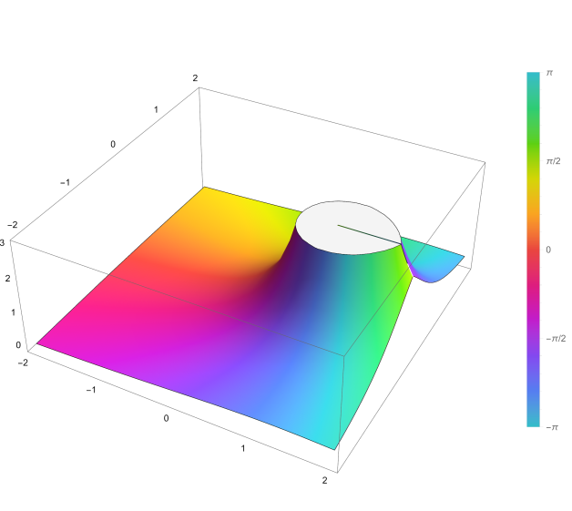

# $Hypergeometric\ Function$

[TOC]

## Define

$$
F(a, b;c;z) = \sum_{n=0}^\infty \frac{(a)_n (b)_n}{(c)_n} \frac{z^n}{n!}
$$

The hypergeometric function is defined for $|z| < 1$ by the power series. ([Complex Value Function](./Complex_Value_Function.md)) It is undefined (or infinite) if c equals a non-positive integer. Here (q)n is the (rising) Pochhammer symbol, which is defined by:
$$
(q)_{n}={\begin{cases}1&n=0\\q(q+1)\cdots (q+n-1)&n>0\end{cases}}
$$

## Property

- Differentiation formulas
  $$
  \begin{align*}
  \frac {\mathrm d}{\mathrm dz} F(a,b;c;z) &= \frac {ab}{c} F(a+1,b+1;c+1;z)  \\
  \frac {\mathrm d^{n}}{\mathrm dz^{n}} F(a,b;c;z) &= \frac {(a)_{n}(b)_{n}}{(c)_{n}} F(a+n,b+n;c+n;z)
  \end{align*}
  $$

- Special cases
  $$
  \begin{align*}
  e^z &= F(;;-z)  \\
  \ln(1+z) &= z F(1, 1;2;-z)\\
  (1+z)^\alpha &= F(-\alpha;;-z)  \\
  \sin z &= z F(;\frac{3}{2};-{z^2}{4})  \\
  \cos z &= F(;\frac{1}{2};-{z^2}{4})  \\
  \arcsin z &= z F(\frac{1}{2}, \frac{1}{2};\frac{3}{2};z^2)  \\
  \arccos z &= z F(\frac{1}{2}, 1;\frac{3}{2};-z^2)  \\
  \end{align*}
  $$
  