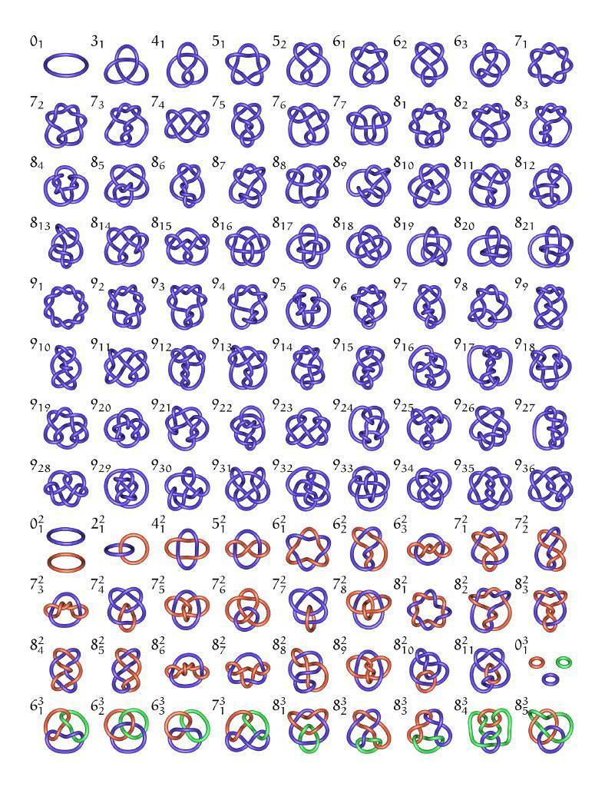
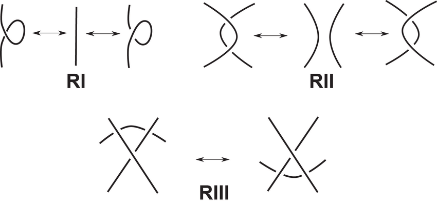

# Knot

[TOC]

## Define

A knot is an embedding of the circle into three-dimensional Euclidean space $S^1 \to \mathbb R^3$, or the 3-sphere $S^3$, since the 3-sphere is compact. Two knots are defined to be equivalent if there is an ambient isotopy between them.

## Property

### Knot Diagram

A knot diagram is a visual representation of a knot, which is a projection of Knot on a plane, where each crossing point is marked as "over" or "under" to indicate which part is above and which part is below.

### Knot isotopy (Ambient isotopy)

Two knots are considered equivalent if one can be deformed into the other without cutting or gluing.

### Reidemeister move

Reidemeister move are a set of three local transformations that can be applied to a knot diagram without changing the underlying knot's equivalence class. Each move operates on a small region of the diagram and is one of three types:

1. Twist and untwist in either direction.
2. Move one loop completely over another.
3. Move a string completely over or under a crossing.

- **Unknotting Theorem**: Any knot can be transformed into its simplified form through a series of Reidemeister movements.

### Knot Invariants

Knot invariants are used to determine whether two knots are equivalent or not.

- **Jones Polynomial**

  Given an oriented link diagram $D$, the Jones polynomial $V(D)$ can be defined recursively using the following relations:
  1. $V(\text{Unknot}) = 1$
  2. $t^{-1} V(L_+) - t V(L_-) = (t^{1/2} - t^{-1/2}) V(L_0)$

  Where $L_+, L_-, L_0$ are link diagrams that are identical outside a small region, and within that region look like:

  - $L_+$: A positive crossing.
  - $L_-$: A negative crossing.
  - $L_0$: The two segments are resolved without a crossing.

  The above recursive relations allow for the calculation of the Jones polynomial of a given link diagram by expanding it in terms of simpler diagrams until reaching the unknot.

- **HOMFLY Polynomial**

  

  