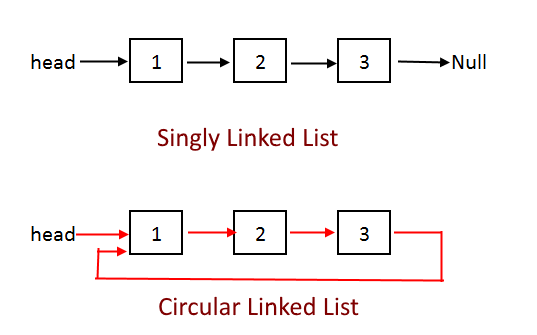

* Linked List
  - Define  
    Linked List is a directed connected graph in which each node has only one incoming edge, with the exception of the head node $a_1$, which has no incoming edge.

    $$
    a_1 \to a_2 \to ... \to a_n
    $$

    Doubly Linked List: A Doubly Linked List is a type of linked list data structure in which each node has two out-edge, one pointing to the previous node and the other pointing to the next node, with the exception of the head node $a_1$ and tail node $a_n$.   

    $$
    a_1 \rightleftharpoons a_2 \rightleftharpoons ... \rightleftharpoons a_n
    $$
    $$
    \begin{align*}
      a_i[\text{prev}] &= a_{i-1}  \\
      a_{i-1}[\text{next}] &= a_{i}
    \end{align*}
    $$
    
    Circular linked List, is a type of linked list in which the last node of the list points back to the first node, creating a closed loop or circle.
    
    


  - Property
    - traversal & search
      ```c
      Node* nd = head;
      
      while (nd != NULL) 
          nd = nd->next;
      ```
      Time complexity of search is $O(n)$.

    - insert a node
      ```c
      void insertNode(Node* nd, Node* left) {
        nd->next = left->next;
        left->next = nd;
      }
      ```

      ```c
      // for Doubly Linked List
      void insertNode(Node* nd, Node* left) {
        // set the edge of the new node
        nd->prev = left;
        nd->next = left->next;
        // modify the edge of the linked node
        left->next->next = nd;
        left->next = nd;
      }
      ```

      Time complexity of insert is $O(1)$.

    - delete a node
      ```c
      void deleteNode(Node* nd, Node* left) {
        if(left != NULL)
            left->next = nd->next;
        nd->next = NULL;
        delete nd;
      }
      ```

      ```c
      // for Doubly Linked List
      void deleteNode(Node* nd) {
        // modify the edge of the remaining linked node
        nd->prev->next = nd->next
        nd->next->prev = nd->prev
        // delete the node and its edges
        nd->prev = NULL;
        nd->next = NULL;
        delete nd;
      }
      ```

      Time complexity of delete is $O(1)$.

    - reverse the linked list
      ```cpp
      Node* reverse(Node* head) {
          Node* p1 = head, * p2 = head->next, * p3;
          p1->next = NULL;
      
          while(p2 != NULL) {
              p3 = p2->next;
              p2->next = p1;
              p1 = p2;
              p2 = p3;
          }
          return p1;
      }
      ```