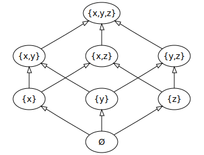

# $Power\ Set$

[TOC]

## Define  
$$
P(S) = \{X \ |\ X \subseteq S\}  \tag{Power Set}
$$
The Power Set of a set $S$ is the set of all subset of $S$, including $\emptyset$ and $S$ itself.

## Property

- The number of elements in the power set of a set $S$ is $2^n$, where $n$ is the number of elements in the set $S$.
  $$
  |P(S)| = 2^{|S|}
  $$

## Include

* $\sigma$-algebra
  - Define  
    $$
    \Sigma \subseteq P(S)  \tag{$\sigma$-algebra}
    $$
    For a set $S$ and its power set $P(S)$, a $\sigma$-algebra $\Sigma$ is a subset of power set such that
    - $S \in \Sigma$, and $S$ is considered to be the universal set in the following context.
    - $\Sigma$ closed under complementation, i.e. $A \in \Sigma$ implies that $A^C = S - A \in \Sigma$. Meanwhile, base on the $S \in \Sigma$ (1) we have $\emptyset \in \Sigma$. 
    - $\Sigma$ is closed under countable unions, i.e. for any sequence $(A_1, ..., A_n), A_i \in \Sigma$, we have that 
      $$
      \bigcup_i A_i \in \Sigma
      $$

  - Property
    - The maximum $\sigma$-algebra is Power Set of $S$,  
      The minimum $\sigma$-algebra is $\{\emptyset, S\}$

    - Countable intersection set closure, if $A_1, ... , A_n \in Σ$, then $\bigcap_i A_i  \in Σ$
      - Proof  
        De Morgan's law

  - Concept
    * Measurable Space & Measure Space

  - Include
    * Borel $\sigma$-algebra 

* Conbination
* Topological Space & Open Set
